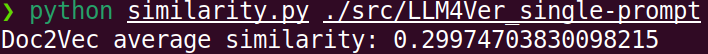
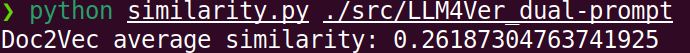
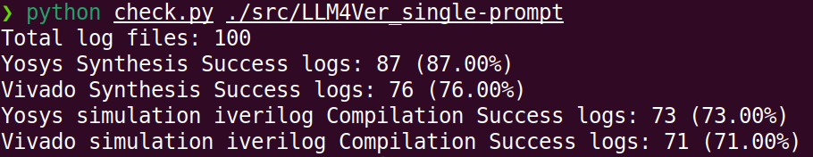
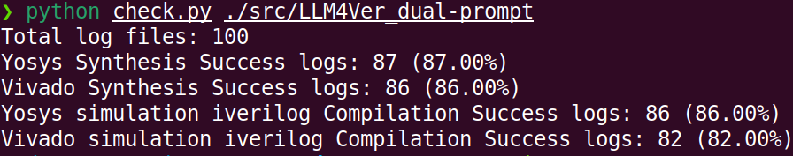

### Dual-Prompt Approach for Code Synthesis

In our study, we explored the use of a dual-prompt approach to enhance code generation using Large Language Models (LLMs). Below are the key findings and insights from our experiments:

#### Motivation
1. **Code Output Similarity**: We initially observed that under limited prompts, LLMs tend to generate code with high similarity in output.
2. **Syntax Tree Structural Information**: To address this, we incorporated syntax tree structural information into the prompts, aiming to guide LLMs to generate more effective and diverse code.

#### Results
- **Cosine Similarity Reduction**: The dual-prompt approach reduced the cosine similarity between different code versions from **30.0%** to **26.2%**, indicating greater diversity in generated code.

- **Success Rate Improvement**: The average success rate of code synthesis and simulation improved from **76.8%** to **85.25%**, demonstrating the effectiveness of the dual-prompt strategy.

#### Conclusion
Our preliminary validation shows that the dual-prompt approach, which integrates syntax tree structural information, leads to more complex and diverse code generation while significantly improving the success rate of code synthesis and simulation.
